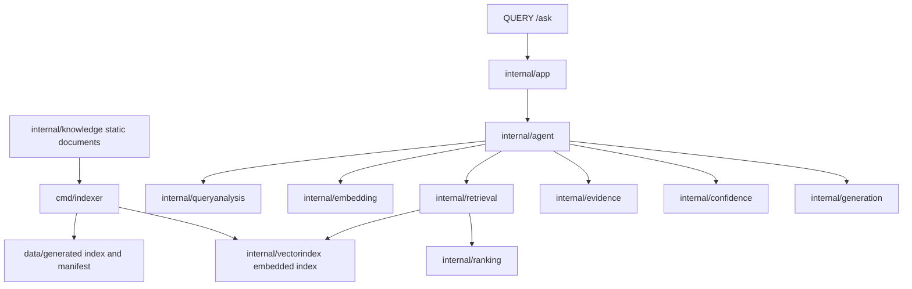

# Portfolio Retrieval Agent

This project is a bilingual portfolio chatbot for answering questions about João Paulo Dias Ventura. It uses a static knowledge base compiled into Go, an offline-generated embedding index, exact in-memory vector search, lexical search, Reciprocal Rank Fusion, metadata reranking, evidence selection, confidence assessment, and grounded response generation.

## What It Solves

Visitors can ask natural-language questions about João Paulo's profile, contact information, education, work experience, technologies, services, certifications, and projects without reading the full portfolio manually. The runtime path is designed for serverless execution: it is stateless, does not use a database, does not write files, and does not index documents during requests.

## Architecture



## Request Flow

1. `QUERY /ask` receives `{ "content": "question" }`.
2. The handler validates JSON, body size, unknown fields, empty content, method routing, and CORS.
3. `internal/app` delegates to the agent service.
4. `internal/queryanalysis` detects language, likely category, temporal status, explicit or inferred project, and exact terms.
5. `internal/embedding` creates the question embedding.
6. `internal/retrieval` runs exact vector search and lexical search over the embedded index.
7. `internal/ranking` combines rankings using Reciprocal Rank Fusion and applies metadata reranking.
8. `internal/evidence` selects compatible evidence and prevents language/project mixing.
9. `internal/confidence` decides whether the evidence is sufficient.
10. `internal/generation` returns a direct fact or a grounded synthesis using only selected evidence.
11. The API returns `{ "response": "answer" }` or a localized not-found message.

## Main Packages

- `cmd/ai-agent`: CLI entrypoint.
- `cmd/indexer`: offline index generator. It writes `data/generated/knowledge.index.json`, `data/generated/manifest.json`, and the embedded copies under `internal/vectorindex/generated`.
- `cmd/evaluator`: runs the retrieval and response evaluation dataset in `data/evaluation.json`.
- `api`: serverless entrypoint.
- `server`: HTTP routing and CORS for `QUERY /ask`.
- `internal/agent`: orchestration contract and end-to-end retrieval flow.
- `internal/domain`: shared document, query, result, and evidence types.
- `internal/embedding`: deterministic local embedder and configurable remote embedding provider.
- `internal/vectorindex`: embedded index types, loading, validation, and integrity checks.
- `internal/retrieval`: exact vector search, lexical search, and hybrid retrieval.
- `internal/ranking`: Reciprocal Rank Fusion and metadata reranking.
- `internal/evidence`: final evidence selection.
- `internal/confidence`: confidence policy for accepting or refusing answers.
- `internal/generation`: direct and grounded answer generation.
- `internal/knowledge`: static bilingual knowledge base.
- `internal/handlers/ask`: request validation and JSON response contract.

## Index Format

The generated index is JSON with:

- `version`
- `model`
- `dimension`
- `base_hash`
- `entries[]` containing document metadata, normalized embedding, and content hash

The manifest stores version, model, dimension, document count, base hash, and generation time. Tests compare the current knowledge base hash with the embedded index hash and verify that public generated files and embedded files are synchronized.

## API

Route: `QUERY /ask`

Request:

```json
{
  "content": "Qual é o email dele?"
}
```

Success response:

```json
{
  "response": "Para entrar em contato com João Paulo por email, use joaopdias.dev@gmail.com."
}
```

Validation and error behavior:

- `400` for invalid JSON, empty content, invalid field types, unknown fields, or multiple JSON objects.
- `404` when the confidence policy does not find enough evidence.
- `413` when the body exceeds 2048 bytes.
- `403` for disallowed CORS origins.

Allowed origins are `https://joaopdias.dev.br` and `http://localhost:4200`.

## Local Commands

```bash
go run ./cmd/indexer
go run ./cmd/evaluator
go run ./cmd/ai-agent
go vet ./...
go test ./...
go build ./...
```

## Configuration

The checked-in index uses the deterministic local embedding model `deterministic-hash-v1` with dimension `128`.

The remote embedding provider is available through environment variables:

- `EMBEDDING_URL`
- `EMBEDDING_MODEL`
- `EMBEDDING_API_KEY`
- `EMBEDDING_DIMENSION`
- `EMBEDDING_TIMEOUT_MS`
- `EMBEDDING_MAX_TEXT_BYTES`

The runtime currently composes the embedded index with the deterministic embedder so local execution and tests do not require network access.

## Testing And Evaluation

Automated tests cover:

- document invariants and metadata;
- embedding providers;
- index generation and embedded index integrity;
- vector retrieval;
- lexical retrieval;
- RRF;
- metadata reranking;
- evidence selection;
- confidence policy;
- grounded generation;
- HTTP validation and CORS;
- serverless-style repeated calls and cancellation.

The evaluator reports Recall@1, Recall@3, Recall@5, MRR, language accuracy, category accuracy, temporal accuracy, response correctness, false positive rate, case count, and average local retrieval latency.

## Trade-Offs

- The index is generated before deployment, which keeps serverless requests small but requires regenerating the index after knowledge-base changes.
- Exact in-memory vector search is simple and deterministic for the current base size, but it scans all vectors.
- The deterministic embedder keeps tests and local execution dependency-free, while the remote provider is available for environments that provide embedding credentials.
- Grounded generation uses selected evidence only. This avoids unsupported claims but limits answers to facts present in the static knowledge base.

## Current Limitations

- There is no database or runtime persistence.
- There is no local LLM or Ollama dependency in production.
- The generated index must stay synchronized with `internal/knowledge`.
- The API exposes `QUERY /ask`, matching the implemented contract.
