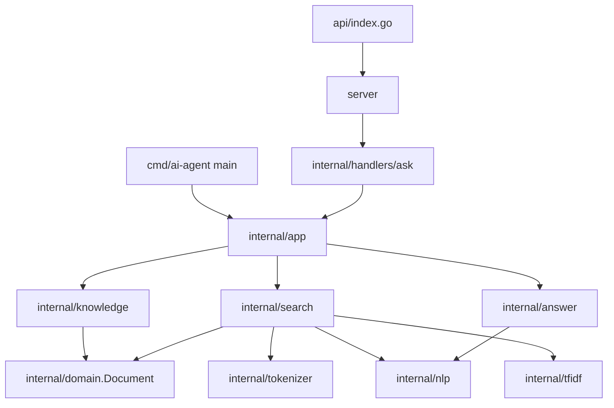
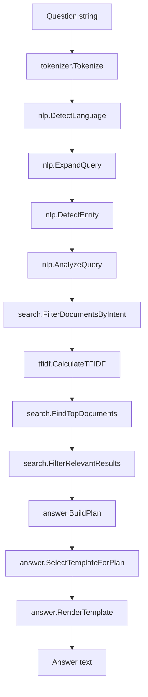

This project is a bilingual portfolio question-answering agent written in Go. It answers short questions about João Paulo Dias Ventura by retrieving facts from a static in-memory knowledge base and rendering concise responses in Portuguese or English.

The project solves a specific portfolio problem: visitors can ask natural-language questions about profile, projects, technologies, services, experience, education, contact information, and hiring reasons without reading every portfolio section manually. It works without external services: the application tokenizes the question, detects language, expands query terms, identifies intent and entities, ranks matching documents with TF-IDF and cosine similarity, applies domain-specific boosts, and formats an answer through language-aware templates.

Its main technical differentiators are the absence of runtime data loading, a deterministic retrieval pipeline built only with the Go standard library, a bilingual document base with explicit language suffixes, and the same core agent being reused by the CLI and HTTP API.

## Table of Contents

- [Project Overview](#project-overview)
- [Problem and Purpose](#problem-and-purpose)
- [Main Capabilities](#main-capabilities)
- [Technical Impact](#technical-impact)
- [Architecture Overview](#architecture-overview)
- [Main Execution Flow](#main-execution-flow)
- [Technology Stack](#technology-stack)
- [Project Structure](#project-structure)
- [Detailed File and Directory Summary](#detailed-file-and-directory-summary)
- [Business Rules](#business-rules)
- [Technical Decisions](#technical-decisions)
- [Trade-offs](#trade-offs)
- [API and Interface Usage](#api-and-interface-usage)
- [Configuration](#configuration)
- [Local Execution](#local-execution)
- [Testing](#testing)
- [Error Handling](#error-handling)
- [Security Considerations](#security-considerations)
- [Current Limitations](#current-limitations)
- [Detailed Documentation](#detailed-documentation)

## Project Overview

The application is a compact question-answering system for a professional portfolio. It exposes two interfaces over the same agent core:

- an interactive CLI started from `cmd/ai-agent`;
- a serverless HTTP entrypoint in `api/index.go`, routed to `QUERY /ask`.

The knowledge base is compiled into Go source code in `internal/knowledge/documents.go`. The current base contains 130 documents: 65 in Portuguese and 65 in English. Portuguese IDs end with `-pt`; English IDs end with `-en`. Documents are shared through pointers returned by `knowledge.Documents()`.

## Problem and Purpose

The project turns portfolio information into a controlled, maintainable question-answering flow. Instead of calling an LLM or embedding provider at runtime, it answers from a bounded set of facts that are visible in the repository.

The purpose is to make non-technical visitors able to ask direct questions such as:

- `Me fale sobre o auronix`
- `Tell me about Auronix`
- `Quais tecnologias João utiliza?`
- `What technologies does João use?`

The system only answers when the retrieval pipeline finds relevant documents above the configured threshold. Otherwise it returns a localized fallback message.

## Main Capabilities

- Bilingual question handling for Portuguese and English.
- Static in-memory facts about identity, profile, career, education, certificates, contact, services, projects, and comparisons.
- Intent detection for topics such as projects, technologies, services, contact, education, current job, first job, and hiring reasons.
- Entity detection for known projects, companies, institutions, and technologies.
- Query expansion for selected Portuguese and English tokens.
- TF-IDF vectorization and cosine similarity ranking.
- Intent-specific boosts for visitor, project, comparison, technology, and default answer modes.
- Template-based answer generation with language-specific wording.
- CLI interaction with exit commands.
- HTTP API with JSON input/output, request-size limit, strict JSON decoding, and CORS handling.

## Technical Impact

The implementation keeps the agent self-contained. There are no external runtime dependencies, no network calls for answer generation, no database connection, and no file loading during startup. This gives the project a small operational surface: the behavior is primarily determined by Go code, static documents, and tests.

The retrieval pipeline also separates responsibilities across packages. HTTP validation stays in `internal/handlers/ask`, orchestration stays in `internal/app`, language and intent analysis stay in `internal/nlp`, ranking stays in `internal/search`, vector math stays in `internal/tfidf`, and response rendering stays in `internal/answer`.

## Architecture Overview



The CLI and HTTP API both call `app.AgentResponse`. At package initialization, `internal/app` builds a global search engine from `knowledge.Documents()` using `minimumSimilarity = 0.1`. Each question is passed through the same retrieval and rendering path.

For more detail, see [Architecture](/docs/en/architecture.md).

## Main Execution Flow



Main sequence:

1. The user submits a question through the CLI or HTTP API.
2. The application trims and validates the input.
3. The search engine tokenizes and analyzes the question.
4. Documents are filtered by detected language and intent.
5. Candidate documents are ranked using TF-IDF, cosine similarity, and boosts.
6. The answer package builds a plan, selects a template, and renders a response.
7. If no relevant result exists, the application returns a localized fallback.

For full flow details, see [Request Flow](/docs/en/request-flow.md).

## Technology Stack

- Go module: `ai-agent`
- Go version declared in `go.mod`: `1.26.3`
- Runtime dependencies: Go standard library only
- Deployment descriptor: `vercel.json`
- Tests: Go `testing` package, `httptest`, and standard assertions

## Project Structure

```text
api/
cmd/
docs/
internal/
server/
go.mod
vercel.json
```

The repository is organized around the execution surfaces and internal processing layers. `api` and `cmd` are entrypoints. `server` adapts HTTP routing and CORS. `internal` contains all agent logic, from documents to search and answer rendering. `docs` contains this technical documentation.

For a complete component-by-component explanation, see [Project Structure](/docs/en/project-structure.md).

## Detailed File and Directory Summary

### `cmd/ai-agent/`

Contains the CLI entrypoint. `main.go` delegates directly to `app.Run()`. The CLI participates in the same business flow as the API because it calls `app.AgentResponse` internally through `internal/app`.

Inputs: stdin lines typed by the user. Outputs: console messages. Side effects: reads stdin and writes stdout. It does not persist data.

### `api/`

Contains the Vercel-compatible function entrypoint. `api/index.go` creates or reuses the HTTP handler from `server.Handler()`. If handler creation returns an error, it writes a `503` service-unavailable JSON response. The current `server.Handler()` implementation does not return an error path, but the API entrypoint handles that contract.

### `server/`

Builds the HTTP server handler. It creates a `ServeMux`, registers `QUERY /ask`, wraps it with CORS, and caches the handler behind a mutex. The mutex protects lazy initialization of the package-level handler.

The CORS layer allows only `https://joaopdias.dev.br` and `http://localhost:4200`. `OPTIONS` requests from allowed origins return `204`; disallowed preflight requests return `403`.

### `internal/app/`

Orchestrates the agent. It initializes the global document slice and search engine, exposes `AgentResponse(question string)`, provides localized fallback messages, and implements the CLI loop.

It depends on `internal/knowledge`, `internal/search`, `internal/answer`, and `internal/nlp`. It intentionally keeps handler-specific concerns outside the agent core.

### `internal/handlers/ask/`

Implements the HTTP JSON contract. It enforces a 2048-byte body limit, disallows unknown JSON fields, rejects empty `content`, rejects multiple JSON objects in the same body, and maps errors to JSON responses.

It depends on `internal/app` for answer generation. It does not access the search engine or documents directly.

### `internal/knowledge/`

Stores the static knowledge base. Documents are compiled into Go as `domain.Document` values and exposed as pointers by `Documents()`. This avoids runtime JSON loading and keeps the source of answers visible in code.

The package is used by `internal/app` when initializing the global search engine.

### `internal/domain/`

Defines the shared `Document` structure with `ID`, `Category`, `Language`, and `Content`. It is used by knowledge, search, and TF-IDF packages as the common document contract.

### `internal/tokenizer/`

Normalizes text by lowercasing it, replacing non-letter/non-number sequences with spaces, splitting on fields, and removing configured Portuguese stopwords. It is used by search and TF-IDF vectorization.

### `internal/nlp/`

Contains rule-based language detection, query expansion, entity detection, intent detection, answer mode detection, and technology extraction. This package is the semantic routing layer of the system, although it uses deterministic rules rather than a statistical model.

### `internal/tfidf/`

Calculates document frequency, term frequency, IDF, TF-IDF vectors, and document vectors. It is used by `internal/search` to rank candidate documents.

### `internal/search/`

Executes retrieval. It owns the `Engine`, filters documents by language and intent, computes question vectors, applies cosine similarity, adds intent-specific boosts, sorts results, and filters by minimum similarity.

This package is intentionally separate from HTTP and answer formatting so retrieval behavior can be tested without transport concerns.

### `internal/answer/`

Converts search results into final text. It extracts facts and technologies, selects detail level, removes duplicated facts, formats multi-fact responses, chooses language-specific templates, and renders placeholders such as `{subject}`, `{fact}`, `{facts}`, and `{technologies}`.

The package uses random template and connector selection, so equivalent questions may produce different wording while using the same facts.

## Business Rules

Detailed rules are documented in [Business Rules](/docs/en/business-rules.md). The most important rules are:

- Questions must contain usable tokens to be searched.
- HTTP requests must contain exactly one JSON object with a non-empty `content` string.
- Questions are answered only when search results pass the minimum similarity threshold.
- Detected language controls both document selection and fallback language.
- Project and technology questions can return multiple documents; most other intents return one result.
- Entity-specific results must contain the resolved entity value in document content.
- Unknown or unrelated questions return localized fallback messages instead of fabricated answers.

## Technical Decisions

Key decisions observable in the code:

- Static in-memory documents are used instead of a runtime data file.
- Retrieval is lexical and deterministic, based on TF-IDF and cosine similarity.
- Intent and language detection are rule-based.
- The same app core serves CLI and HTTP entrypoints.
- HTTP routing uses `QUERY /ask`.
- The API is constrained to a small JSON body and strict JSON object shape.
- Vercel deployment is represented by `vercel.json`.

See [Technical Decisions](/docs/en/technical-decisions.md).

## Trade-offs

The implementation favors local control and a small dependency surface. That gives predictable behavior and simple deployment inputs, but it also means the system is limited to the documents, aliases, keywords, expansions, and templates explicitly represented in code.

The TF-IDF ranking avoids external services and model calls, but it cannot infer meaning beyond token overlap, query expansion, intent rules, and boosts. The static document base avoids runtime I/O, but content changes require code changes.

## API and Interface Usage

### CLI

```powershell
go run ./cmd/ai-agent
```

Exit commands:

- `sair`
- `exit`
- `quit`
- `encerrar`

### HTTP API

The server registers:

```text
QUERY /ask
Content-Type: application/json
```

Request:

```json
{
  "content": "Tell me about Auronix"
}
```

Successful response:

```json
{
  "response": "About this project: Auronix is a digital banking project built to simulate transfers, track financial movements, and show real-time updates."
}
```

The exact wording can vary because templates and connectors are selected randomly.

See [HTTP API](/docs/en/http-api.md).

## Configuration

The project has no environment-variable loading in the current code. Runtime constants are defined in code:

- `minimumSimilarity = 0.1`
- `maximumSearchResults = 5`
- `maxRequestBodyBytes = 2048`
- allowed origins in `server/server.go`

Vercel deployment behavior is represented by `vercel.json`, which routes all requests to `/api/index` and sets `api/index.go` `maxDuration` to `10`.

## Local Execution

Install dependencies:

```powershell
go mod download
```

Run the CLI:

```powershell
go run ./cmd/ai-agent
```

List packages:

```powershell
go list ./...
```

There is no standalone local HTTP server command in the current code because no `ListenAndServe` entrypoint is defined.

## Testing

Run all tests:

```powershell
go test ./...
```

The current tests cover language detection, search behavior, app responses, HTTP validation, and knowledge-base invariants. See [Testing](/docs/en/testing.md).

## Error Handling

The HTTP handler maps input failures to JSON responses:

- `400` for invalid JSON, invalid field type, empty body, empty `content`, multiple JSON objects, or generic invalid body.
- `413` when the request body exceeds 2048 bytes.
- `404` when the agent cannot find a relevant answer.
- `403` for disallowed CORS preflight origins.
- `503` from the serverless entrypoint if handler creation fails.

The CLI skips empty input and prints scanner errors if stdin fails.

## Security Considerations

The project does not implement authentication or authorization. Security-related behavior currently present in code is limited to strict JSON parsing, body-size limiting, CORS origin allowlisting, no runtime file loading, no database access, and no outbound model/API calls.

## Current Limitations

- Search is lexical and rule-based, not semantic.
- The knowledge base is static and compiled into the application.
- Only Portuguese and English documents are present.
- HTTP routing uses `QUERY /ask`.
- There is no local HTTP server executable.
- There is no persistence layer.
- There is no authentication layer.
- Template selection uses randomness, so exact response text is not stable.
- Language detection depends on configured token weights.
- Unknown facts outside the static documents cannot be answered.

## Detailed Documentation

- [Architecture](/docs/en/architecture.md)
- [Request Flow](/docs/en/request-flow.md)
- [Business Rules](/docs/en/business-rules.md)
- [Search and Ranking](/docs/en/search-and-ranking.md)
- [Answer Generation](/docs/en/answer-generation.md)
- [HTTP API](/docs/en/http-api.md)
- [Project Structure](/docs/en/project-structure.md)
- [Technical Decisions](/docs/en/technical-decisions.md)
- [Testing](/docs/en/testing.md)
