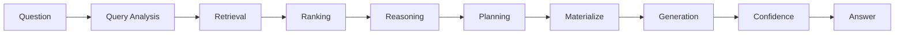

# ai-agent

Deterministic Go question-answering agent for local knowledge base. It uses structured facts, ontology concepts, lexical/entity/concept/fuzzy retrieval, ranking, reasoning, planning, materialization, generation, and confidence scoring. It does not use LLMs, external APIs, external embeddings, or conversation state.

## Documentation

- [English documentation](./docs/en/README.md)
- [Documentação em Português](./docs/pt/README.md)

## Quick Start

```bash
go run ./cmd/ai-agent
go test ./...
go test -race ./...
```

## Public Contracts

- `agent.Service.Answer(question)` returns the public answer result.
- `agent.Service.Debug(question)` returns the same public result plus query, retrieval, ranking, reasoning, planning, generation, and confidence internals.


```mermaid
flowchart LR
  Q[Question] --> A[Query Analysis]
  A --> R[Retrieval]
  R --> K[Ranking]
  K --> S[Reasoning]
  S --> P[Planning]
  P --> M[Materialize]
  M --> G[Generation]
  G --> C[Confidence]
  C --> O[Answer]
```

If evidence is insufficient, the public result has `HasResponse=false` and an empty `Response`; CLI and HTTP layers can apply their own fallback messages.
