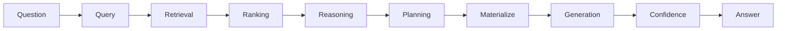

# AI Agent Documentation

[Index](./README.md) | [Português](../pt/README.md)

Technical documentation for `ai-agent`, a deterministic Go agent. The project has no LLM path, no external API path, no external embeddings, and no conversation state.

## Map

- [Architecture](./architecture.md)
- [Domain and Knowledge](./domain-knowledge.md)
- [Language and Query](./language-query.md)
- [Ontology](./ontology.md)
- [Indexing and Retrieval](./index-retrieval.md)
- [Ranking](./ranking.md)
- [Reasoning](./reasoning.md)
- [Planning and Generation](./planning-generation.md)
- [Confidence](./confidence.md)
- [Agent, CLI, and HTTP](./interfaces.md)
- [Evaluation and Testing](./evaluation-testing.md)
- [Mathematics and Invariants](./mathematics-invariants.md)

