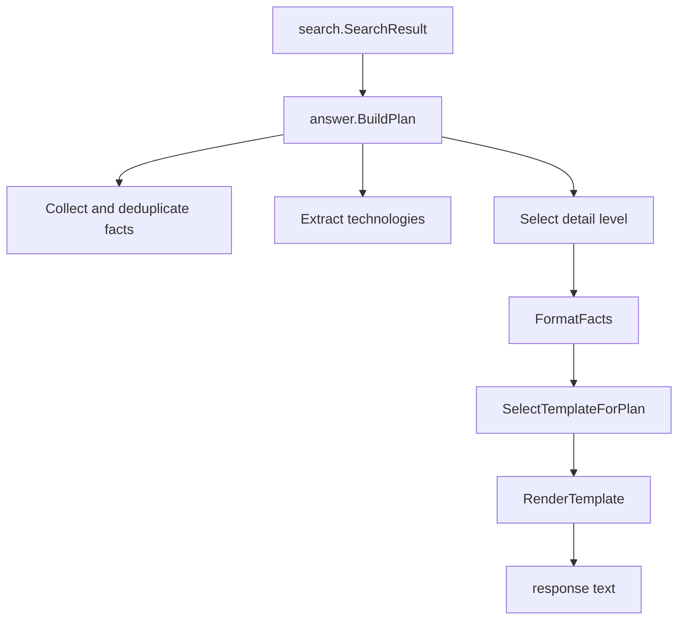

# Answer Generation

## Purpose

`internal/answer` converts ranked search results into user-facing text. It does not perform retrieval. It receives a `search.SearchResult`, builds a `Plan`, selects a template, and renders placeholders.

## Flow

## Plan Fields

`Plan` contains:

- `Intent`
- `Language`
- `Subject`
- `Facts`
- `Technologies`
- `DetailLevel`
- `FormattedFacts`

The subject defaults to `João Paulo`. If the first result has an entity, the subject becomes the entity value.

## Facts And Technologies

Facts come from `result.Document.Content`. Duplicate facts are removed with a lowercase normalized key. Technologies are extracted from document content using `nlp.ExtractTechnologies` and the configured `KnownTechnologies` list.

## Detail Level

Default detail level is medium. Portuguese tokens such as `brevemente`, `resuma`, `explique`, `detalhes`, and `detalhadamente` can change the level. Visitor-oriented intents convert the default medium level to short.

## Templates

Templates are grouped by language and intent. If no template exists for the language, Portuguese templates are used as fallback. If no template exists for the intent, `{fact}` is used.

Template selection is random when multiple templates exist. Multi-fact formatting also uses weighted random connectors. This makes the exact response text intentionally non-stable while keeping facts and retrieval behavior bounded.

## Rendering

`RenderTemplate` replaces:

- `{subject}`
- `{fact}`
- `{facts}`
- `{technologies}`

Technology lists use `and` in English and `e` in Portuguese. If no technology is available, the response uses a localized "not specified" phrase.
