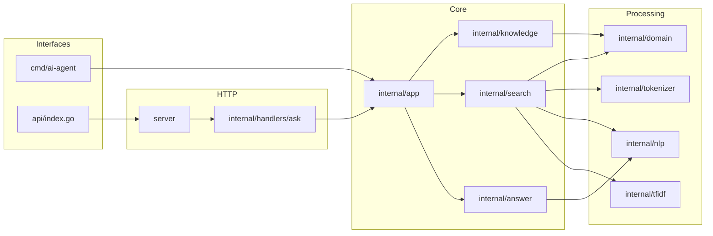

# Architecture

## Overview

This project is organized as a layered Go application. Public entrypoints delegate to `internal/app`, and the app package coordinates knowledge retrieval and answer generation.

## Initialization

`internal/app/agent.go` initializes package-level values:

- `documents = knowledge.Documents()`
- `engine = search.NewEngine(documents, minimumSimilarity)`

`search.NewEngine` calculates IDF values and document vectors once when the engine is created. The CLI and HTTP paths reuse this engine through `app.AgentResponse`.

## Package Responsibilities

| Package | Responsibility | Main Dependencies |
| --- | --- | --- |
| `cmd/ai-agent` | Starts the interactive CLI. | `internal/app` |
| `api` | Vercel function entrypoint. | `server` |
| `server` | HTTP mux, CORS, handler caching. | `internal/handlers/ask` |
| `internal/handlers/ask` | JSON request validation and HTTP response mapping. | `internal/app` |
| `internal/app` | Agent orchestration and CLI loop. | `knowledge`, `search`, `answer`, `nlp` |
| `internal/knowledge` | Static document base exposed by pointer. | `internal/domain` |
| `internal/search` | Retrieval, ranking, filtering, boosts. | `domain`, `nlp`, `tfidf`, `tokenizer` |
| `internal/nlp` | Rule-based language, intent, entity, answer mode, and technology logic. | Standard library |
| `internal/tfidf` | TF-IDF vector construction. | `domain`, `tokenizer` |
| `internal/answer` | Response planning, templates, formatting, rendering. | `nlp`, `search` |

## Data Ownership

Documents are stored in `internal/knowledge/documents.go` as static Go values. `knowledge.Documents()` returns pointers to these values. Search results carry `*domain.Document`, so the pipeline passes references to existing documents instead of copying document structs.

## Concurrency

The only explicit synchronization is in `server.Handler()`, which uses a mutex to guard lazy creation of the package-level HTTP handler. The search engine and documents are built once and then read by request handlers.

## Deployment Shape

`vercel.json` routes all incoming requests to `/api/index`. The Go function entrypoint delegates to `server.Handler()`. The code does not define a local HTTP server with `ListenAndServe`.
