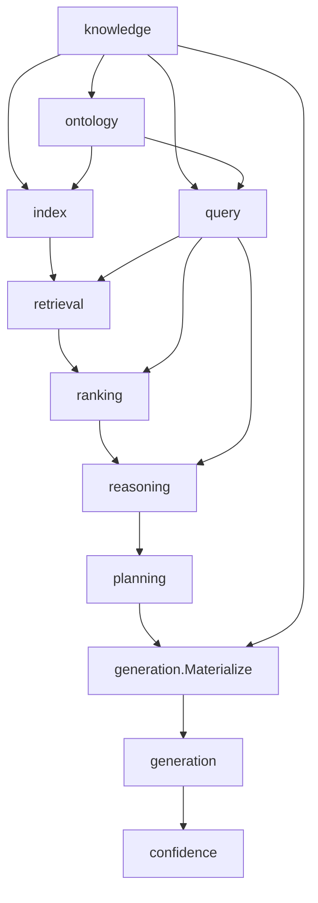

# Architecture

[Index](./README.md) | [Português](../pt/architecture.md)

The project is a deterministic in-memory question-answering pipeline. `agent.New()` wires the layers in this order: `knowledge`, `ontology`, `index`, `query`, `retrieval`, `ranking`, `reasoning`, `planning`, `generation`, and `confidence`.

```mermaid
flowchart TD
  K[knowledge] --> O[ontology]
  K --> I[index]
  O --> I
  K --> Q[query]
  O --> Q
  I --> R[retrieval]
  Q --> R
  R --> RK[ranking]
  Q --> RK
  RK --> RS[reasoning]
  Q --> RS
  RS --> P[planning]
  P --> M[generation.Materialize]
  K --> M
  M --> G[generation]
  G --> C[confidence]
```

The main architectural rule is that lower layers do not invent behavior for higher layers. Query analysis resolves language, intent, target, entities, concepts, and temporal scope. Retrieval discovers candidates. Ranking orders them. Reasoning decides support or `insufficient_evidence`. Planning selects authorized sections, facts, and entities. Generation only realizes the plan. Confidence audits the whole execution.

The service is stateless. It stores immutable structures built at construction time and keeps no conversation history. Tests cover deterministic repeated calls and concurrent calls.
