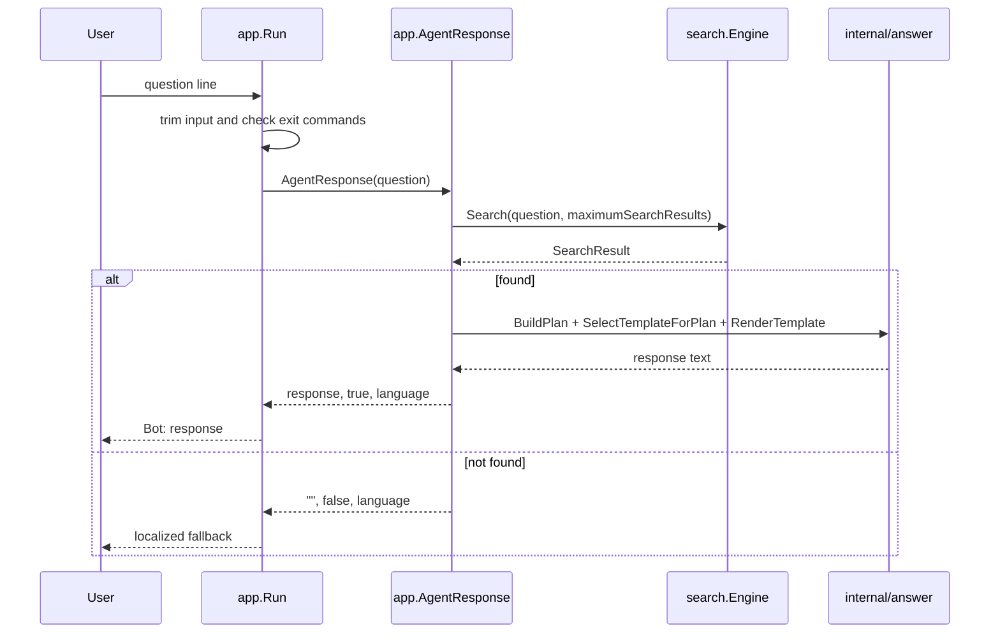
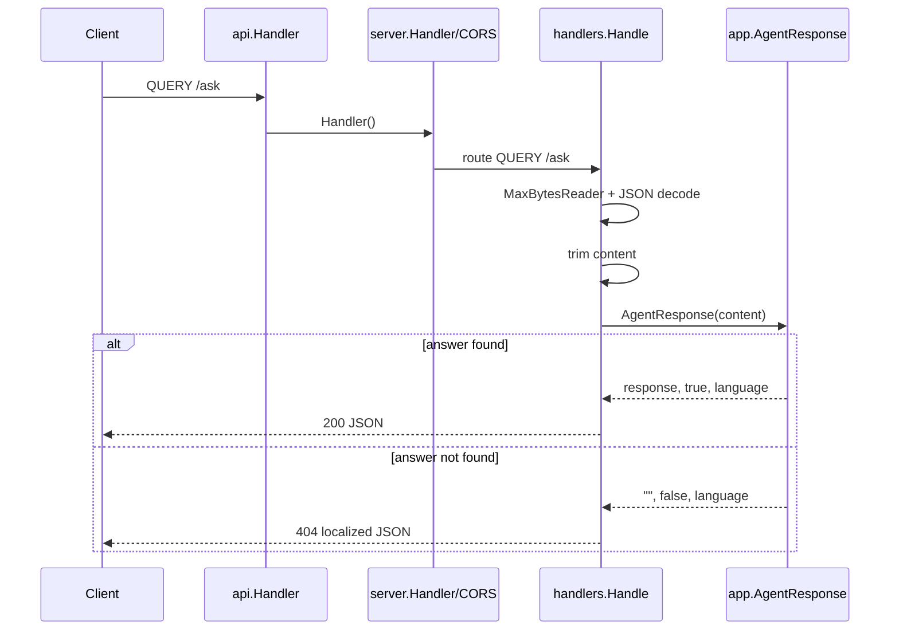
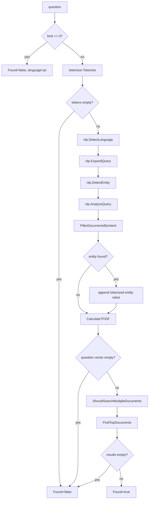

# Request Flow

## CLI Flow

The CLI reads from stdin with `bufio.Scanner`. Empty lines are ignored. The commands `sair`, `exit`, `quit`, and `encerrar` terminate the loop.

## HTTP Flow

## Search Flow

Each not-found path preserves the detected language when detection has already happened. The limit validation path defaults to Portuguese because no token analysis is performed.
