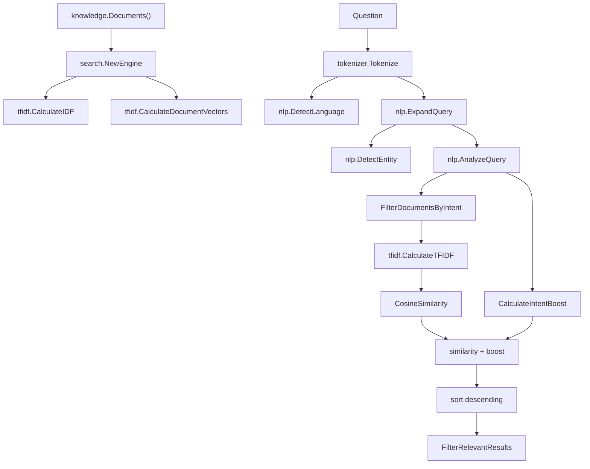

# Search And Ranking

## Purpose

`internal/search` retrieves the documents that will feed answer generation. It is independent from HTTP and CLI concerns and operates over `*domain.Document`.

## Ranking Pipeline



## Candidate Filtering

Filtering applies language first. A document must have the same `Language` as the detected query language. Then intent-specific category or ID rules are applied.

Examples:

- `IntentContact` uses `Category == "contact"`.
- `IntentVisitorServices` uses `Category == "service"`.
- `IntentCurrentJob` matches the base ID `career-current-job` through `documentIDMatches`, which accepts unsuffixed, `-pt`, and `-en` variants.
- `IntentTechnologies` includes `technology`, `project`, and `career` documents.

If no candidate matches, the function returns the original document set. This fallback exists in the current implementation and broadens the search instead of failing immediately.

## Similarity

The system uses TF-IDF vectors and cosine similarity. Empty vectors or zero magnitudes produce similarity `0`. The final score used for sorting is:

```text
cosine similarity + intent boost
```

## Boosts

Boost logic is split by behavior:

- visitor intent boosts for summary, projects, services, and hiring reasons;
- general technology boosts for technology questions;
- project about boosts;
- project technology boosts;
- project comparison boosts;
- default project boosts.

Boosts are deterministic and based on intent, entity, document ID, category, and content phrases.

## Relevance Filtering

After sorting and limit selection, `FilterRelevantResults` removes results below `MinimumSimilarity`. For entity-specific questions, it also removes results whose content does not contain the resolved entity value.

## Operational Consequence

The pipeline is predictable and testable, but it depends on lexical overlap, manually configured expansions, known entities, and explicit boosts. It does not infer meaning from context beyond these rules.
