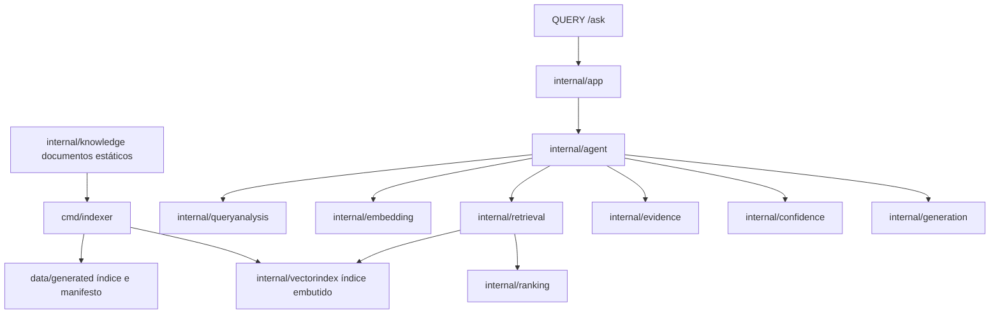

# Agente De Recuperação Do Portfólio

Este projeto é um chatbot bilíngue de portfólio para responder perguntas sobre João Paulo Dias Ventura. Ele usa uma base de conhecimento estática compilada em Go, um índice de embeddings gerado offline, busca vetorial exata em memória, busca lexical, Reciprocal Rank Fusion, reranking por metadados, seleção de evidências, política de confiança e geração fundamentada de respostas.

## Problema Resolvido

Visitantes podem fazer perguntas em linguagem natural sobre perfil, contato, formação, experiência, tecnologias, serviços, certificações e projetos de João Paulo sem ler manualmente todo o portfólio. O caminho de runtime foi desenhado para execução serverless: é stateless, não usa banco de dados, não escreve arquivos e não indexa documentos durante requisições.

## Arquitetura



## Fluxo De Requisição

1. `QUERY /ask` recebe `{ "content": "pergunta" }`.
2. O handler valida JSON, tamanho do body, campos desconhecidos, conteúdo vazio, roteamento do método e CORS.
3. `internal/app` delega ao serviço do agente.
4. `internal/queryanalysis` detecta idioma, categoria provável, temporalidade, projeto explícito ou inferido e termos exatos.
5. `internal/embedding` cria o embedding da pergunta.
6. `internal/retrieval` executa busca vetorial exata e busca lexical sobre o índice embutido.
7. `internal/ranking` combina rankings com Reciprocal Rank Fusion e aplica reranking por metadados.
8. `internal/evidence` seleciona evidências compatíveis e evita mistura de idioma ou projeto.
9. `internal/confidence` decide se há evidência suficiente.
10. `internal/generation` retorna um fato direto ou uma síntese fundamentada usando apenas as evidências selecionadas.
11. A API retorna `{ "response": "resposta" }` ou uma mensagem localizada de ausência de informação.

## Pacotes Principais

- `cmd/ai-agent`: ponto de entrada da CLI.
- `cmd/indexer`: gerador offline do índice.
- `cmd/evaluator`: executa o dataset de avaliação em `data/evaluation.json`.
- `api`: ponto de entrada serverless.
- `server`: roteamento HTTP e CORS para `QUERY /ask`.
- `internal/agent`: orquestração do fluxo completo de recuperação.
- `internal/domain`: tipos compartilhados de documento, consulta, resultado e evidência.
- `internal/embedding`: embedder determinístico local e provedor remoto configurável.
- `internal/vectorindex`: tipos, carregamento, validação e integridade do índice embutido.
- `internal/retrieval`: busca vetorial exata, busca lexical e recuperação híbrida.
- `internal/ranking`: Reciprocal Rank Fusion e reranking por metadados.
- `internal/evidence`: seleção final de evidências.
- `internal/confidence`: política de confiança.
- `internal/generation`: resposta direta e geração fundamentada.
- `internal/knowledge`: base de conhecimento bilíngue estática.
- `internal/handlers/ask`: validação da requisição e contrato JSON.

## Comandos Locais

```bash
go run ./cmd/indexer
go run ./cmd/evaluator
go run ./cmd/ai-agent
go vet ./...
go test ./...
go build ./...
```

## Configuração

O índice versionado usa o modelo determinístico local `deterministic-hash-v1` com dimensão `128`.

O provedor remoto de embeddings usa variáveis de ambiente:

- `EMBEDDING_URL`
- `EMBEDDING_MODEL`
- `EMBEDDING_API_KEY`
- `EMBEDDING_DIMENSION`
- `EMBEDDING_TIMEOUT_MS`
- `EMBEDDING_MAX_TEXT_BYTES`

O runtime atual compõe o índice embutido com o embedder determinístico para que execução local e testes não dependam de rede.

## Avaliação

O avaliador reporta Recall@1, Recall@3, Recall@5, MRR, acerto de idioma, categoria e temporalidade, taxa de resposta correta, taxa de falso positivo, quantidade de casos e latência média da recuperação local.

## Trade-Offs

- O índice é gerado antes do deploy, reduzindo trabalho por requisição, mas exigindo regeneração após mudanças na base.
- A busca vetorial exata é simples e determinística para o tamanho atual da base, mas percorre todos os vetores.
- O embedder determinístico mantém testes e execução local sem dependências externas; o provedor remoto existe para ambientes com credenciais.
- A geração usa somente evidências selecionadas, evitando afirmações sem suporte, mas limitando respostas aos fatos da base estática.

## Limitações Atuais

- Não há banco de dados ou persistência em runtime.
- Não há dependência de LLM local ou Ollama em produção.
- O índice gerado precisa permanecer sincronizado com `internal/knowledge`.
- A API expõe `QUERY /ask`, conforme o contrato implementado.
