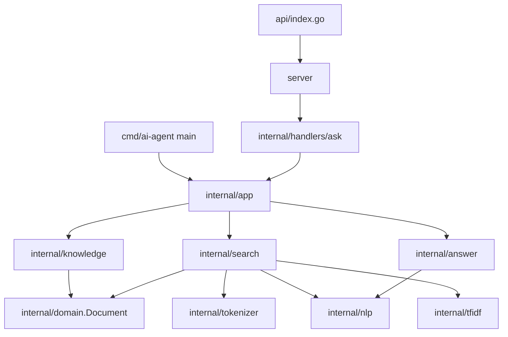
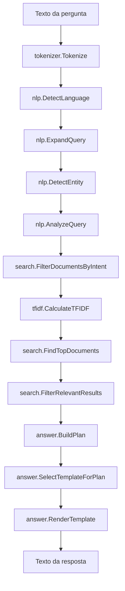

Esse projeto é um agente bilíngue de perguntas e respostas para portfólio, escrito em Go. Ele responde perguntas curtas sobre João Paulo Dias Ventura recuperando fatos de uma base de conhecimento estática em memória e renderizando respostas concisas em português ou inglês.

O projeto resolve um problema específico de portfólio: visitantes podem fazer perguntas em linguagem natural sobre perfil, projetos, tecnologias, serviços, experiência, formação, contato e motivos para contratação sem precisar ler manualmente todas as seções do portfólio. Ele funciona sem serviços externos: a aplicação tokeniza a pergunta, detecta o idioma, expande termos da consulta, identifica intenção e entidades, ranqueia documentos correspondentes com TF-IDF e similaridade cosseno, aplica boosts específicos de domínio e formata uma resposta por templates sensíveis ao idioma.

Seus principais diferenciais técnicos são a ausência de carregamento de dados em runtime, um pipeline determinístico de recuperação construído apenas com a biblioteca padrão do Go, uma base bilíngue de documentos com sufixos explícitos de idioma e o reaproveitamento do mesmo núcleo do agente pela CLI e pela API HTTP.

## Sumário

- [Visão Geral Do Projeto](#visão-geral-do-projeto)
- [Problema E Propósito](#problema-e-propósito)
- [Principais Capacidades](#principais-capacidades)
- [Impacto Técnico](#impacto-técnico)
- [Visão Geral Da Arquitetura](#visão-geral-da-arquitetura)
- [Fluxo Principal De Execução](#fluxo-principal-de-execução)
- [Stack Tecnológica](#stack-tecnológica)
- [Estrutura Do Projeto](#estrutura-do-projeto)
- [Resumo Detalhado De Arquivos E Diretórios](#resumo-detalhado-de-arquivos-e-diretórios)
- [Regras De Negócio](#regras-de-negócio)
- [Decisões Técnicas](#decisões-técnicas)
- [Trade-offs](#trade-offs)
- [Uso Da API E Das Interfaces](#uso-da-api-e-das-interfaces)
- [Configuração](#configuração)
- [Execução Local](#execução-local)
- [Testes](#testes)
- [Tratamento De Erros](#tratamento-de-erros)
- [Considerações De Segurança](#considerações-de-segurança)
- [Limitações Atuais](#limitações-atuais)
- [Documentação Detalhada](#documentação-detalhada)

## Visão Geral Do Projeto

A aplicação é um sistema compacto de perguntas e respostas para um portfólio profissional. Ela expõe duas interfaces sobre o mesmo núcleo do agente:

- uma CLI interativa iniciada em `cmd/ai-agent`;
- um ponto de entrada HTTP serverless em `api/index.go`, roteado para `QUERY /ask`.

A base de conhecimento é compilada em código Go em `internal/knowledge/documents.go`. A base atual contém 130 documentos: 65 em português e 65 em inglês. IDs em português terminam com `-pt`; IDs em inglês terminam com `-en`. Os documentos são compartilhados por ponteiros retornados por `knowledge.Documents()`.

## Problema E Propósito

O projeto transforma informações de portfólio em um fluxo controlado e manutenível de perguntas e respostas. Em vez de chamar um LLM ou provedor de embeddings em runtime, ele responde a partir de um conjunto limitado de fatos visível no repositório.

O propósito é permitir que visitantes não técnicos façam perguntas diretas como:

- `Me fale sobre o auronix`
- `Tell me about Auronix`
- `Quais tecnologias João utiliza?`
- `What technologies does João use?`

O sistema só responde quando o pipeline de recuperação encontra documentos relevantes acima do threshold configurado. Caso contrário, retorna uma mensagem de fallback localizada.

## Principais Capacidades

- Tratamento bilíngue de perguntas em português e inglês.
- Fatos estáticos em memória sobre identidade, perfil, carreira, formação, certificados, contato, serviços, projetos e comparações.
- Detecção de intenção para temas como projetos, tecnologias, serviços, contato, formação, emprego atual, primeiro emprego e motivos de contratação.
- Detecção de entidades para projetos, empresas, instituições e tecnologias conhecidas.
- Expansão de consulta para tokens selecionados em português e inglês.
- Vetorização TF-IDF e ranqueamento por similaridade cosseno.
- Boosts específicos de intenção para modos de visitante, projeto, comparação, tecnologia e resposta padrão.
- Geração de resposta baseada em templates com textos por idioma.
- Interação via CLI com comandos de saída.
- API HTTP com entrada/saída JSON, limite de tamanho de requisição, decodificação JSON estrita e CORS.

## Impacto Técnico

A implementação mantém o agente autocontido. Não existem dependências externas em runtime, chamadas de rede para geração de resposta, conexão com banco de dados ou carregamento de arquivo durante a inicialização. Isso reduz a superfície operacional do projeto: o comportamento é determinado principalmente por código Go, documentos estáticos e testes.

O pipeline de recuperação também separa responsabilidades entre pacotes. A validação HTTP fica em `internal/handlers/ask`, a orquestração fica em `internal/app`, a análise de idioma e intenção fica em `internal/nlp`, o ranqueamento fica em `internal/search`, o cálculo vetorial fica em `internal/tfidf` e a renderização de respostas fica em `internal/answer`.

## Visão Geral Da Arquitetura



A CLI e a API HTTP chamam `app.AgentResponse`. Na inicialização do pacote, `internal/app` cria um engine global de busca a partir de `knowledge.Documents()` usando `minimumSimilarity = 0.1`. Cada pergunta passa pelo mesmo caminho de recuperação e renderização.

Para mais detalhes, consulte [Arquitetura](architecture.md).

## Fluxo Principal De Execução



Sequência principal:

1. O usuário envia uma pergunta pela CLI ou API HTTP.
2. A aplicação remove espaços externos e valida a entrada.
3. O engine de busca tokeniza e analisa a pergunta.
4. Os documentos são filtrados por idioma detectado e intenção.
5. Documentos candidatos são ranqueados usando TF-IDF, similaridade cosseno e boosts.
6. O pacote de resposta cria um plano, seleciona um template e renderiza a resposta.
7. Se não houver resultado relevante, a aplicação retorna um fallback localizado.

Para detalhes completos, consulte [Fluxo De Requisição](request-flow.md).

## Stack Tecnológica

- Módulo Go: `ai-agent`
- Versão Go declarada em `go.mod`: `1.26.3`
- Dependências em runtime: somente biblioteca padrão do Go
- Descritor de deploy: `vercel.json`
- Testes: pacote `testing` do Go, `httptest` e asserts com biblioteca padrão

## Estrutura Do Projeto

```text
api/
cmd/
docs/
internal/
server/
go.mod
vercel.json
```

O repositório é organizado em torno das superfícies de execução e das camadas internas de processamento. `api` e `cmd` são pontos de entrada. `server` adapta roteamento HTTP e CORS. `internal` contém toda a lógica do agente, desde documentos até busca e renderização de respostas. `docs` contém esta documentação técnica.

Para uma explicação completa componente a componente, consulte [Estrutura Do Projeto](project-structure.md).

## Resumo Detalhado De Arquivos E Diretórios

### `cmd/ai-agent/`

Contém o ponto de entrada da CLI. `main.go` delega diretamente para `app.Run()`. A CLI participa do mesmo fluxo de negócio da API porque chama `app.AgentResponse` internamente por meio de `internal/app`.

Entradas: linhas de stdin digitadas pelo usuário. Saídas: mensagens no console. Efeitos colaterais: lê stdin e escreve stdout. Não persiste dados.

### `api/`

Contém o ponto de entrada compatível com Vercel. `api/index.go` cria ou reutiliza o handler HTTP vindo de `server.Handler()`. Se a criação do handler retornar erro, escreve uma resposta JSON `503` de serviço indisponível. A implementação atual de `server.Handler()` não possui caminho de erro, mas o ponto de entrada da API trata esse contrato.

### `server/`

Constrói o handler HTTP. Cria um `ServeMux`, registra `QUERY /ask`, envolve o mux com CORS e guarda o handler em cache com mutex. O mutex protege a inicialização preguiçosa do handler em nível de pacote.

A camada de CORS permite apenas `https://joaopdias.dev.br` e `http://localhost:4200`. Requisições `OPTIONS` de origens permitidas retornam `204`; preflights de origens não permitidas retornam `403`.

### `internal/app/`

Orquestra o agente. Inicializa a lista global de documentos e o engine de busca, expõe `AgentResponse(question string)`, fornece mensagens de fallback localizadas e implementa o loop da CLI.

Depende de `internal/knowledge`, `internal/search`, `internal/answer` e `internal/nlp`. Mantém preocupações específicas de handler fora do núcleo do agente.

### `internal/handlers/ask/`

Implementa o contrato HTTP JSON. Aplica limite de body de 2048 bytes, rejeita campos JSON desconhecidos, rejeita `content` vazio, rejeita múltiplos objetos JSON no mesmo body e mapeia erros para respostas JSON.

Depende de `internal/app` para geração de respostas. Não acessa diretamente o engine de busca nem os documentos.

### `internal/knowledge/`

Armazena a base de conhecimento estática. Os documentos são compilados em Go como valores `domain.Document` e expostos como ponteiros por `Documents()`. Isso evita carregamento JSON em runtime e mantém a fonte das respostas visível em código.

O pacote é usado por `internal/app` ao inicializar o engine global de busca.

### `internal/domain/`

Define a estrutura compartilhada `Document` com `ID`, `Category`, `Language` e `Content`. É usada pelos pacotes de conhecimento, busca e TF-IDF como contrato comum de documento.

### `internal/tokenizer/`

Normaliza texto convertendo para minúsculas, substituindo sequências que não são letras nem números por espaços, separando por campos e removendo stopwords configuradas em português. É usado pela busca e pela vetorização TF-IDF.

### `internal/nlp/`

Contém detecção de idioma baseada em regras, expansão de consulta, detecção de entidades, detecção de intenção, detecção de modo de resposta e extração de tecnologias. Este pacote é a camada de roteamento semântico do sistema, embora use regras determinísticas em vez de um modelo estatístico.

### `internal/tfidf/`

Calcula frequência de documentos, frequência de termos, IDF, vetores TF-IDF e vetores de documentos. É usado por `internal/search` para ranquear documentos candidatos.

### `internal/search/`

Executa a recuperação. Controla o `Engine`, filtra documentos por idioma e intenção, calcula vetores da pergunta, aplica similaridade cosseno, adiciona boosts específicos de intenção, ordena resultados e filtra por similaridade mínima.

Esse pacote fica separado de HTTP e formatação de respostas para permitir teste da recuperação sem preocupações de transporte.

### `internal/answer/`

Converte resultados de busca em texto final. Extrai fatos e tecnologias, seleciona nível de detalhe, remove fatos duplicados, formata respostas com múltiplos fatos, escolhe templates por idioma e renderiza placeholders como `{subject}`, `{fact}`, `{facts}` e `{technologies}`.

O pacote usa seleção aleatória de templates e conectores, então perguntas equivalentes podem produzir textos diferentes usando os mesmos fatos.

## Regras De Negócio

As regras detalhadas estão documentadas em [Regras De Negócio](business-rules.md). As principais são:

- Perguntas devem conter tokens utilizáveis para serem buscadas.
- Requisições HTTP devem conter exatamente um objeto JSON com uma string `content` não vazia.
- Perguntas só são respondidas quando os resultados passam pela similaridade mínima.
- O idioma detectado controla a seleção de documentos e o idioma do fallback.
- Perguntas de projeto e tecnologia podem retornar múltiplos documentos; a maioria das outras intenções retorna um resultado.
- Resultados específicos de entidade devem conter o valor da entidade resolvida no conteúdo do documento.
- Perguntas desconhecidas ou sem relação retornam fallback localizado em vez de respostas fabricadas.

## Decisões Técnicas

Decisões principais observáveis no código:

- Documentos estáticos em memória são usados em vez de arquivo de dados em runtime.
- A recuperação é léxica e determinística, baseada em TF-IDF e similaridade cosseno.
- Detecção de intenção e idioma é baseada em regras.
- O mesmo núcleo de aplicação atende CLI e HTTP.
- O roteamento HTTP usa `QUERY /ask`.
- A API é limitada a um body JSON pequeno e formato estrito de objeto.
- O deploy na Vercel está representado por `vercel.json`.

Consulte [Decisões Técnicas](technical-decisions.md).

## Trade-offs

A implementação favorece controle local e uma superfície pequena de dependências. Isso oferece comportamento previsível e entradas simples para deploy, mas também limita o sistema aos documentos, aliases, keywords, expansões e templates explicitamente representados no código.

O ranqueamento TF-IDF evita serviços externos e chamadas a modelos, mas não infere significado além de sobreposição de tokens, expansão de consulta, regras de intenção e boosts. A base estática evita I/O em runtime, mas mudanças de conteúdo exigem alterações de código.

## Uso Da API E Das Interfaces

### CLI

```powershell
go run ./cmd/ai-agent
```

Comandos de saída:

- `sair`
- `exit`
- `quit`
- `encerrar`

### API HTTP

O servidor registra:

```text
QUERY /ask
Content-Type: application/json
```

Requisição:

```json
{
  "content": "Tell me about Auronix"
}
```

Resposta de sucesso:

```json
{
  "response": "About this project: Auronix is a digital banking project built to simulate transfers, track financial movements, and show real-time updates."
}
```

O texto exato pode variar porque templates e conectores são selecionados aleatoriamente.

Consulte [API HTTP](http-api.md).

## Configuração

O projeto não possui carregamento de variáveis de ambiente no código atual. Constantes de runtime são definidas em código:

- `minimumSimilarity = 0.1`
- `maximumSearchResults = 5`
- `maxRequestBodyBytes = 2048`
- origens permitidas em `server/server.go`

O comportamento de deploy na Vercel é representado por `vercel.json`, que roteia todas as requisições para `/api/index` e define `maxDuration` de `api/index.go` como `10`.

## Execução Local

Instalar dependências:

```powershell
go mod download
```

Executar a CLI:

```powershell
go run ./cmd/ai-agent
```

Listar pacotes:

```powershell
go list ./...
```

Não há comando de servidor HTTP local standalone no código atual porque nenhum ponto de entrada com `ListenAndServe` está definido.

## Testes

Executar todos os testes:

```powershell
go test ./...
```

Os testes atuais cobrem detecção de idioma, comportamento de busca, respostas da aplicação, validação HTTP e invariantes da base de conhecimento. Consulte [Testes](testing.md).

## Tratamento De Erros

O handler HTTP mapeia falhas de entrada para respostas JSON:

- `400` para JSON inválido, tipo inválido de campo, body vazio, `content` vazio, múltiplos objetos JSON ou body genericamente inválido.
- `413` quando o body excede 2048 bytes.
- `404` quando o agente não encontra resposta relevante.
- `403` para preflight CORS de origem não permitida.
- `503` no ponto de entrada serverless se a criação do handler falhar.

A CLI ignora entrada vazia e imprime erros do scanner se a leitura de stdin falhar.

## Considerações De Segurança

O projeto não implementa autenticação ou autorização. O comportamento relacionado à segurança presente no código é limitado a parsing JSON estrito, limite de tamanho de body, allowlist de origem CORS, ausência de carregamento de arquivos em runtime, ausência de acesso a banco de dados e ausência de chamadas externas para modelos ou APIs.

## Limitações Atuais

- A busca é léxica e baseada em regras, não semântica.
- A base de conhecimento é estática e compilada na aplicação.
- Apenas documentos em português e inglês estão presentes.
- O roteamento HTTP usa `QUERY /ask`.
- Não há executável de servidor HTTP local.
- Não há camada de persistência.
- Não há camada de autenticação.
- A seleção de templates usa aleatoriedade, então o texto exato da resposta não é estável.
- A detecção de idioma depende dos pesos de tokens configurados.
- Fatos desconhecidos fora dos documentos estáticos não podem ser respondidos.

## Documentação Detalhada

- [Arquitetura](architecture.md)
- [Fluxo De Requisição](request-flow.md)
- [Regras De Negócio](business-rules.md)
- [Busca E Ranqueamento](search-and-ranking.md)
- [Geração De Resposta](answer-generation.md)
- [API HTTP](http-api.md)
- [Estrutura Do Projeto](project-structure.md)
- [Decisões Técnicas](technical-decisions.md)
- [Testes](testing.md)
