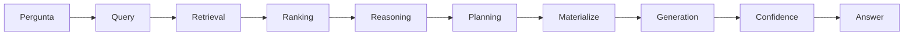

# Documentação do AI Agent

[Índice](./README.md) | [English](../en/README.md)

Documentação técnica do `ai-agent`, um agente Go determinístico. O projeto não possui caminho de LLM, APIs externas, embeddings externos nem estado de conversa.

## Mapa

- [Arquitetura](./architecture.md)
- [Domain e Knowledge](./domain-knowledge.md)
- [Language e Query](./language-query.md)
- [Ontologia](./ontology.md)
- [Indexação e Retrieval](./index-retrieval.md)
- [Ranking](./ranking.md)
- [Reasoning](./reasoning.md)
- [Planning e Generation](./planning-generation.md)
- [Confidence](./confidence.md)
- [Agent, CLI e HTTP](./interfaces.md)
- [Evaluation e Testing](./evaluation-testing.md)
- [Matemática e Invariantes](./mathematics-invariants.md)

```mermaid
flowchart LR
  Q[Pergunta] --> QA[Query]
  QA --> RT[Retrieval]
  RT --> RK[Ranking]
  RK --> RS[Reasoning]
  RS --> PL[Planning]
  PL --> MT[Materialize]
  MT --> GN[Generation]
  GN --> CF[Confidence]
  CF --> AN[Answer]
```
