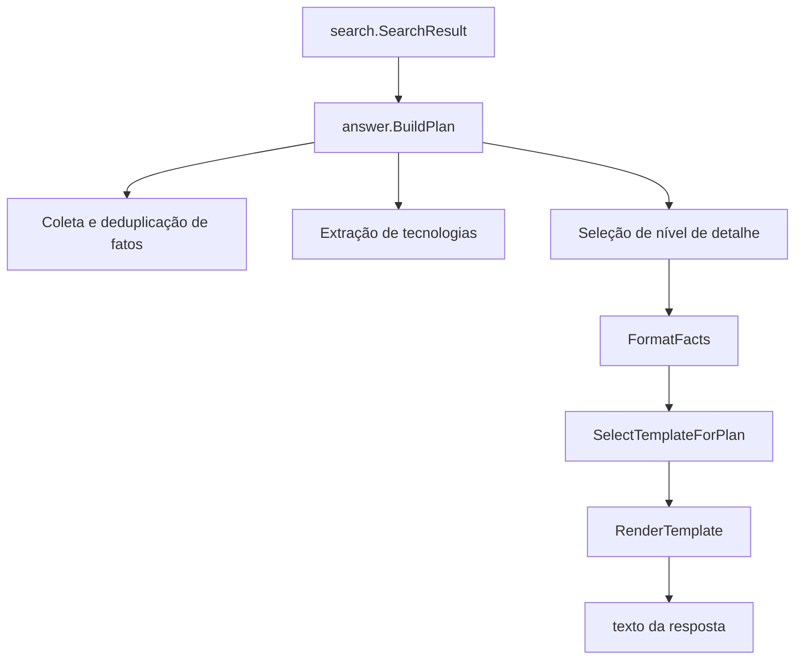

# Geração De Resposta

## Propósito

`internal/answer` converte resultados ranqueados de busca em texto para o usuário. Ele não executa recuperação. Recebe um `search.SearchResult`, cria um `Plan`, seleciona um template e renderiza placeholders.

## Fluxo

## Campos Do Plan

`Plan` contém:

- `Intent`
- `Language`
- `Subject`
- `Facts`
- `Technologies`
- `DetailLevel`
- `FormattedFacts`

O assunto padrão é `João Paulo`. Se o primeiro resultado possui entidade, o assunto passa a ser o valor da entidade.

## Fatos E Tecnologias

Fatos vêm de `result.Document.Content`. Fatos duplicados são removidos usando uma chave normalizada em minúsculas. Tecnologias são extraídas do conteúdo dos documentos por `nlp.ExtractTechnologies` e pela lista configurada `KnownTechnologies`.

## Nível De Detalhe

O nível de detalhe padrão é médio. Tokens em português como `brevemente`, `resuma`, `explique`, `detalhes` e `detalhadamente` podem alterar o nível. Intenções voltadas a visitante convertem o nível médio padrão para curto.

## Templates

Templates são agrupados por idioma e intenção. Se não houver template para o idioma, templates em português são usados como fallback. Se não houver template para a intenção, `{fact}` é usado.

A seleção de template é aleatória quando existem múltiplos templates. A formatação de múltiplos fatos também usa conectores aleatórios ponderados. Isso torna o texto exato da resposta intencionalmente não estável, mantendo fatos e recuperação limitados ao código.

## Renderização

`RenderTemplate` substitui:

- `{subject}`
- `{fact}`
- `{facts}`
- `{technologies}`

Listas de tecnologias usam `and` em inglês e `e` em português. Se nenhuma tecnologia estiver disponível, a resposta usa uma frase localizada de "não especificadas".
