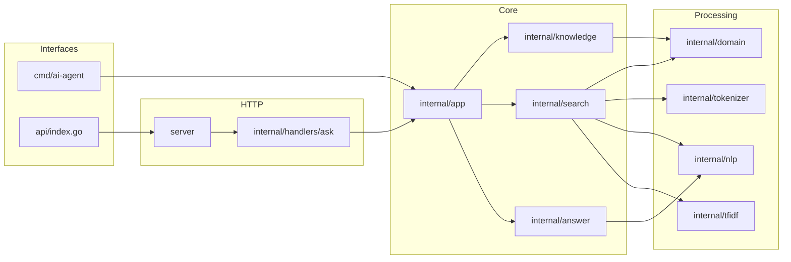

# Arquitetura

## Visão Geral

Esse projeto é organizado como uma aplicação Go em camadas. Os pontos de entrada públicos delegam para `internal/app`, e o pacote da aplicação coordena recuperação de conhecimento e geração de resposta.

## Inicialização

`internal/app/agent.go` inicializa valores em nível de pacote:

- `documents = knowledge.Documents()`
- `engine = search.NewEngine(documents, minimumSimilarity)`

`search.NewEngine` calcula valores de IDF e vetores de documentos uma vez quando o engine é criado. A CLI e o caminho HTTP reutilizam esse engine por meio de `app.AgentResponse`.

## Responsabilidades Dos Pacotes

| Pacote | Responsabilidade | Principais Dependências |
| --- | --- | --- |
| `cmd/ai-agent` | Inicia a CLI interativa. | `internal/app` |
| `api` | Ponto de entrada da função Vercel. | `server` |
| `server` | Mux HTTP, CORS e cache do handler. | `internal/handlers/ask` |
| `internal/handlers/ask` | Validação JSON e mapeamento de respostas HTTP. | `internal/app` |
| `internal/app` | Orquestração do agente e loop da CLI. | `knowledge`, `search`, `answer`, `nlp` |
| `internal/knowledge` | Base estática de documentos exposta por ponteiro. | `internal/domain` |
| `internal/search` | Recuperação, ranqueamento, filtragem e boosts. | `domain`, `nlp`, `tfidf`, `tokenizer` |
| `internal/nlp` | Regras de idioma, intenção, entidade, modo de resposta e tecnologias. | Biblioteca padrão |
| `internal/tfidf` | Construção de vetores TF-IDF. | `domain`, `tokenizer` |
| `internal/answer` | Planejamento, templates, formatação e renderização da resposta. | `nlp`, `search` |

## Posse Dos Dados

Os documentos ficam em `internal/knowledge/documents.go` como valores Go estáticos. `knowledge.Documents()` retorna ponteiros para esses valores. Resultados de busca carregam `*domain.Document`, então o pipeline passa referências para documentos existentes em vez de copiar structs de documento.

## Concorrência

A única sincronização explícita está em `server.Handler()`, que usa um mutex para proteger a criação preguiçosa do handler HTTP em nível de pacote. O engine de busca e os documentos são construídos uma vez e depois lidos pelos handlers de requisição.

## Formato De Deploy

`vercel.json` roteia todas as requisições recebidas para `/api/index`. O ponto de entrada da função Go delega para `server.Handler()`. O código não define servidor HTTP local com `ListenAndServe`.
