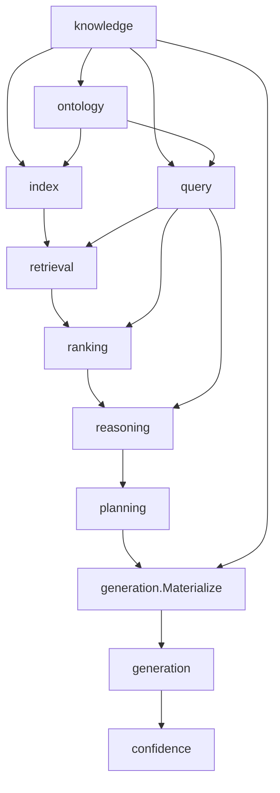

# Arquitetura

[Índice](./README.md) | [English](../en/architecture.md)

O projeto é uma pipeline determinística em memória para perguntas e respostas. `agent.New()` conecta as camadas nesta ordem: `knowledge`, `ontology`, `index`, `query`, `retrieval`, `ranking`, `reasoning`, `planning`, `generation` e `confidence`.

```mermaid
flowchart TD
  K[knowledge] --> O[ontology]
  K --> I[index]
  O --> I
  K --> Q[query]
  O --> Q
  I --> R[retrieval]
  Q --> R
  R --> RK[ranking]
  Q --> RK
  RK --> RS[reasoning]
  Q --> RS
  RS --> P[planning]
  P --> M[generation.Materialize]
  K --> M
  M --> G[generation]
  G --> C[confidence]
```

A regra arquitetural principal é que camadas inferiores não inventam comportamento para camadas superiores. Query analysis resolve idioma, intent, target, entidades, conceitos e escopo temporal. Retrieval descobre candidatos. Ranking ordena. Reasoning decide suporte ou `insufficient_evidence`. Planning seleciona seções, fatos e entidades autorizados. Generation apenas realiza o plano. Confidence audita a execução inteira.

O serviço é stateless. Ele guarda estruturas imutáveis construídas na inicialização e não mantém histórico de conversa. Os testes cobrem chamadas repetidas determinísticas e chamadas concorrentes.
