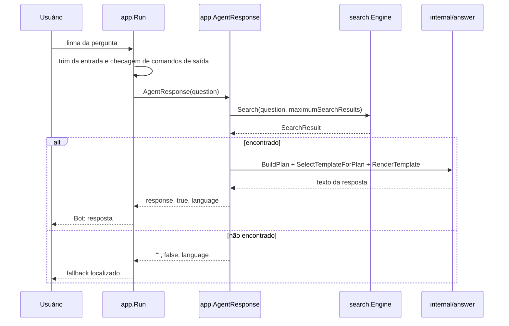
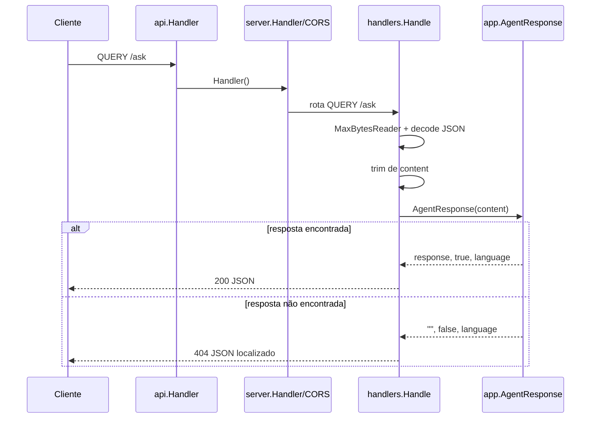
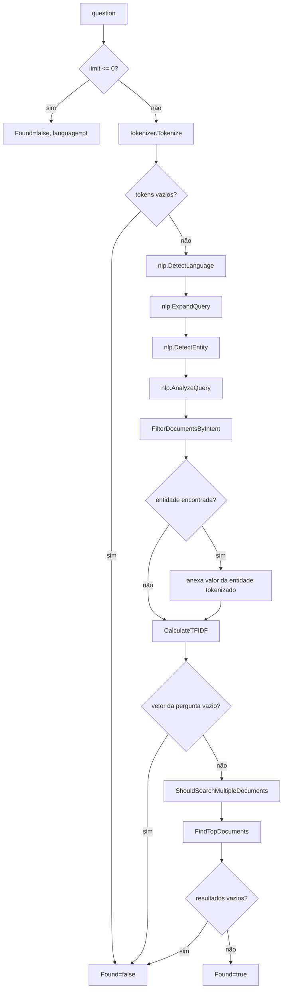

# Fluxo De Requisição

## Fluxo Da CLI

A CLI lê stdin com `bufio.Scanner`. Linhas vazias são ignoradas. Os comandos `sair`, `exit`, `quit` e `encerrar` encerram o loop.

## Fluxo HTTP

## Fluxo De Busca

Cada caminho de não encontrado preserva o idioma detectado quando a detecção já aconteceu. O caminho de validação de limite usa português como padrão porque nenhuma análise de tokens é executada.
