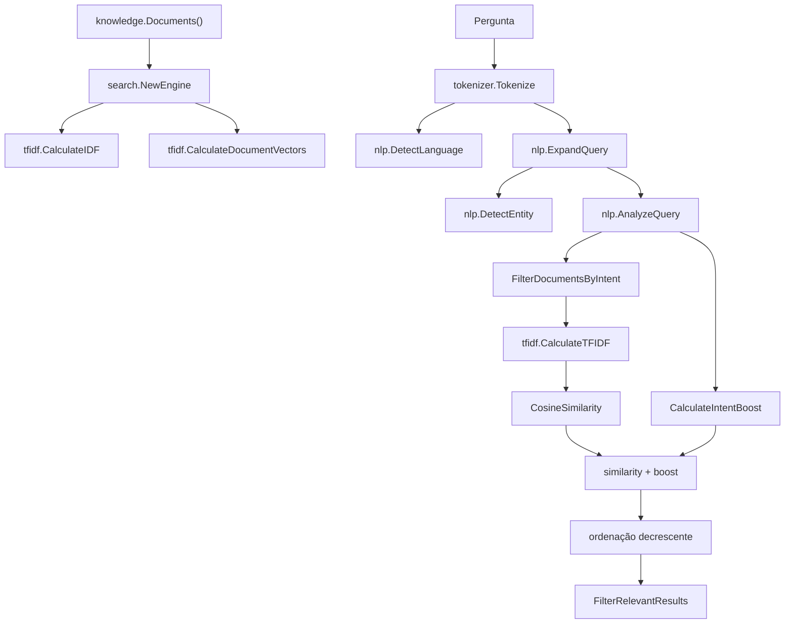

# Busca E Ranqueamento

## Propósito

`internal/search` recupera os documentos que alimentarão a geração de resposta. Ele é independente das preocupações de HTTP e CLI e opera sobre `*domain.Document`.

## Pipeline De Ranqueamento



## Filtragem De Candidatos

A filtragem aplica idioma primeiro. Um documento deve ter o mesmo `Language` do idioma detectado na consulta. Depois, regras por categoria ou ID específicas da intenção são aplicadas.

Exemplos:

- `IntentContact` usa `Category == "contact"`.
- `IntentVisitorServices` usa `Category == "service"`.
- `IntentCurrentJob` corresponde ao ID base `career-current-job` por meio de `documentIDMatches`, que aceita variantes sem sufixo, `-pt` e `-en`.
- `IntentTechnologies` inclui documentos `technology`, `project` e `career`.

Se nenhum candidato corresponder, a função retorna o conjunto original de documentos. Esse fallback existe na implementação atual e amplia a busca em vez de falhar imediatamente.

## Similaridade

O sistema usa vetores TF-IDF e similaridade cosseno. Vetores vazios ou magnitudes zero produzem similaridade `0`. A pontuação final usada para ordenação é:

```text
similaridade cosseno + boost de intenção
```

## Boosts

A lógica de boosts é separada por comportamento:

- boosts de intenção de visitante para resumo, projetos, serviços e motivos de contratação;
- boosts gerais de tecnologia para perguntas de tecnologia;
- boosts sobre projeto;
- boosts de tecnologia de projeto;
- boosts de comparação de projeto;
- boosts padrão de projeto.

Os boosts são determinísticos e baseados em intenção, entidade, ID do documento, categoria e frases no conteúdo.

## Filtragem De Relevância

Após ordenação e seleção por limite, `FilterRelevantResults` remove resultados abaixo de `MinimumSimilarity`. Para perguntas específicas de entidade, também remove resultados cujo conteúdo não contém o valor da entidade resolvida.

## Consequência Operacional

O pipeline é previsível e testável, mas depende de sobreposição léxica, expansões configuradas manualmente, entidades conhecidas e boosts explícitos. Ele não infere significado por contexto além dessas regras.
